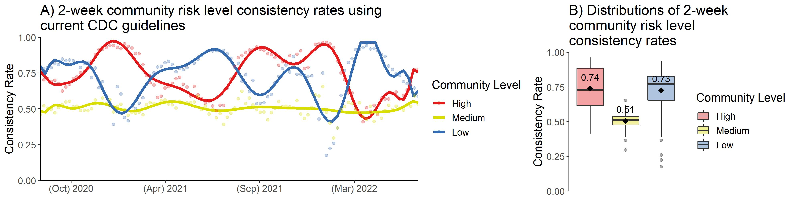
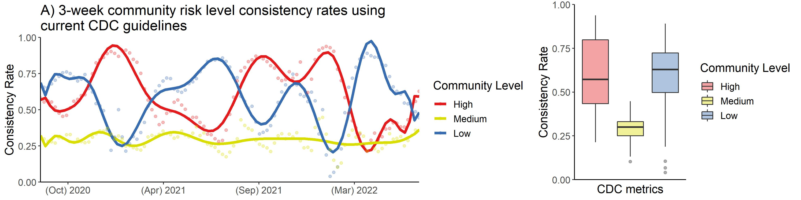
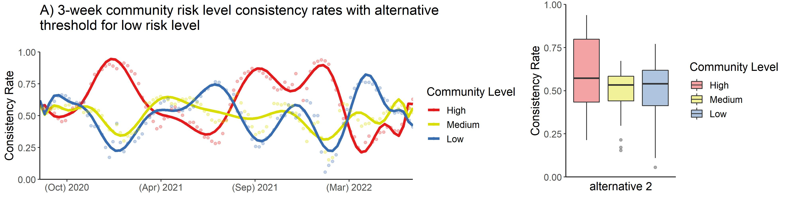
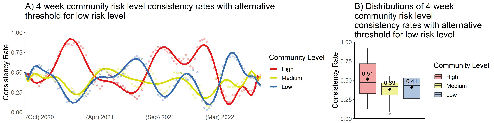
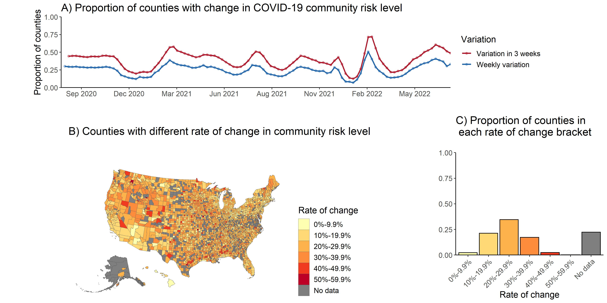

```{r setup, include=FALSE}
knitr::opts_chunk$set(echo = TRUE)
```


```{r include = FALSE, echo = FALSE}
# load libraries
library(dplyr)
library(ggplot2)
library(tidyr)
library(usdata)
library(gridExtra)
library(tidycensus)
library(sf)
library(tigris)
```


## Community COVID-19 risk level consistency rates over time

#### 2 weeks interval
```{r echo=FALSE}

```


#### 3 weeks interval
```{r echo=FALSE}

```


#### 4 weeks interval
```{r echo=FALSE}


```


\newpage

## Community risk level consistency rates with alternative threshold for low risk level

#### 2 weeks interval
```{r echo=FALSE}

```


#### 3 weeks interval
```{r echo=FALSE}

```


#### 4 weeks interval
```{r echo=FALSE}


```

\newpage

## Weekly variation in county COVID-19 community risk level

```{r echo=FALSE}

```


\newpage

## Community risk level consistency rates for each NCHS Urban-Rural Category
```{r echo=FALSE}


```


\newpage

```{r echo=FALSE}


```


