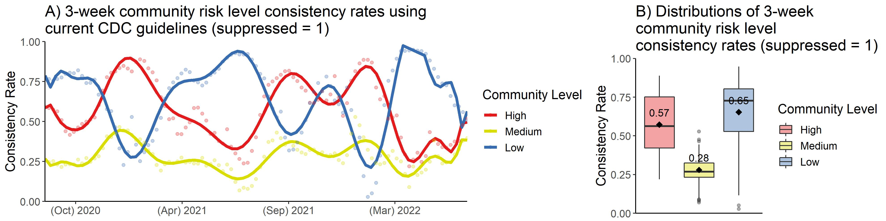
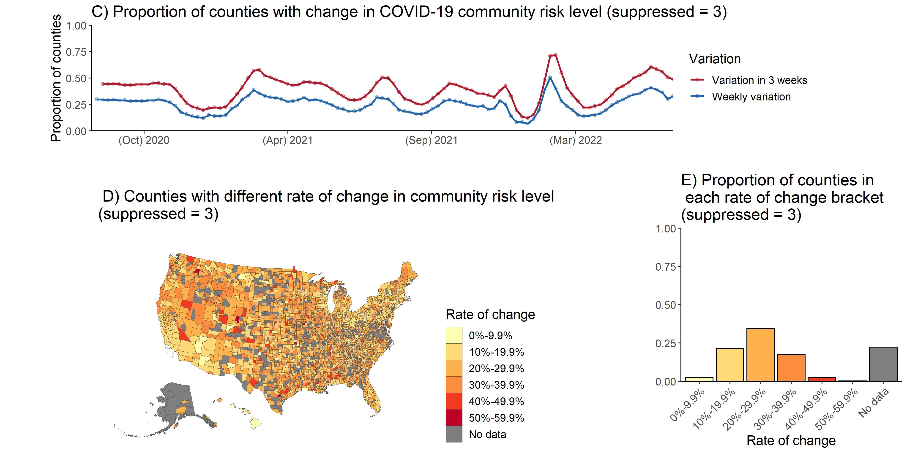
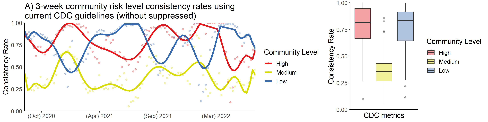
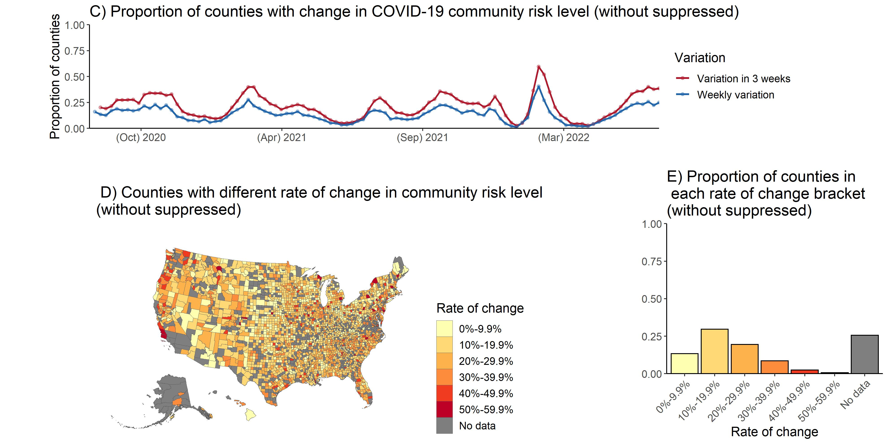
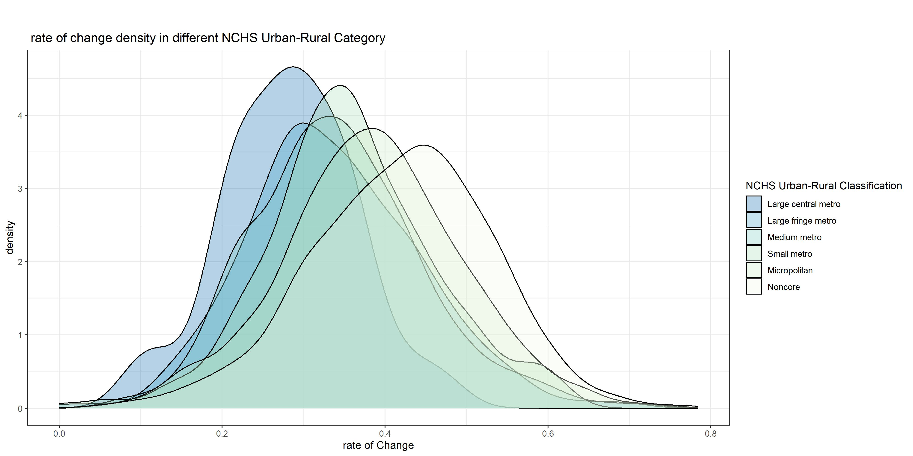
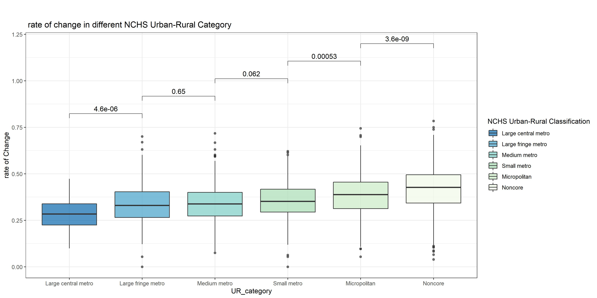
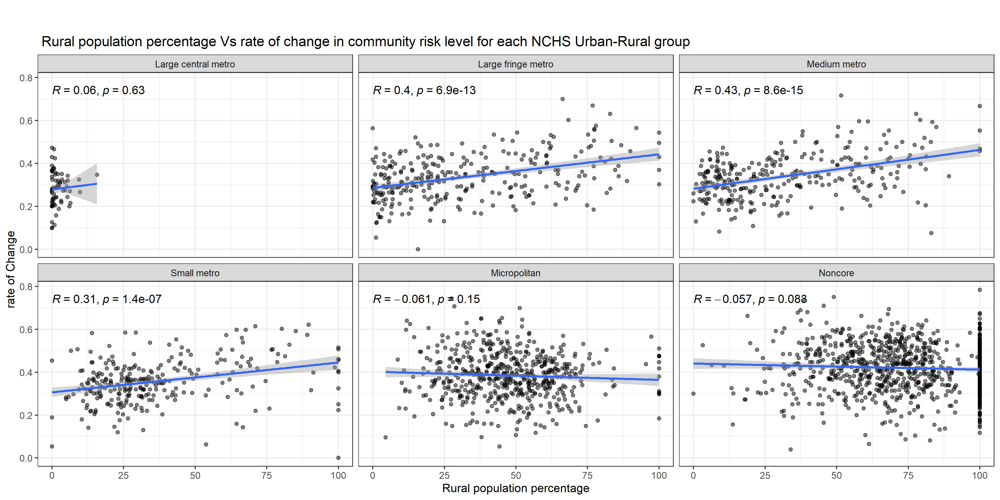
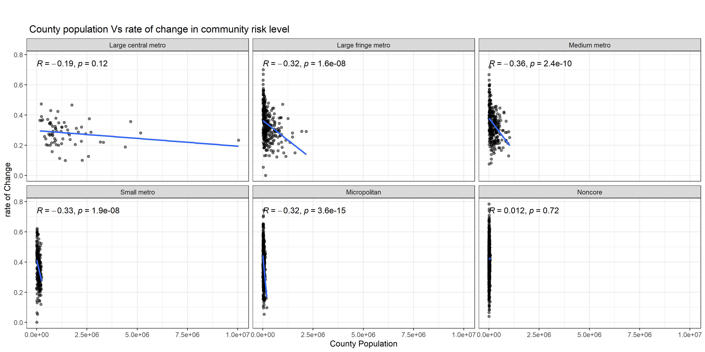
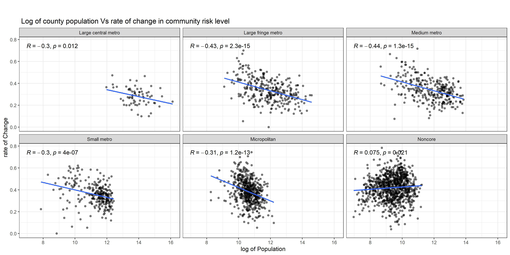

```{r setup, include=FALSE}
knitr::opts_chunk$set(echo = TRUE)
```


```{r include = FALSE, echo = FALSE}
# load libraries
library(dplyr)
library(ggplot2)
library(tidyr)
library(usdata)
library(gridExtra)
library(tidycensus)
library(sf)
library(tigris)
```

 
# The impact of supperpassed on risk level calculation
Based on HealthData.gov, Suppression is applied to the values with sums and averages less than four (4). In these cases, the field is replaced with “-999,999”. In our study, we replaced the suppression values with a randomly selected number between 1, 2, or 3 and then calculated the risk level. The following plots applied three other methods for replacing “suppression” to see how they affect the risk level. 

## suppressed = random between (1, 2, 3)


```{r echo=FALSE}
knitr::include_graphics("Result/Figures/compare_consisRate_3week_LMH.jpg")
```


```{r echo=FALSE}
knitr::include_graphics("Result/Figures/fig_combine_variation_LMH.jpg")

```


\newpage

## 1. suppressed = 1

```{r echo=FALSE}

```

```{r echo=FALSE}

```


\newpage

## 2. suppressed = 3
```{r echo=FALSE}

```

```{r echo=FALSE}


```

\newpage

### 3. suppressed = NA

```{r echo=FALSE}



```


```{r echo=FALSE}

```


We have almost the same risk level when suppression = three and suppression = random number. The mean consistency rate in counties with high-risk level decrease, and in counties with low-risk level increase when we set suppression = one. However, if we remove suppressed data, the mean consistency rate increase in counties with low, medium, and high risk levels.

\newpage

# Consistency results for urban counties and rural counties separately.

We use National Center for Health Statistics (NCHS) data systems to study the associations between the urbanization level of the residents. NCHS has developed a six-level urban-rural classification scheme for U.S. counties. The most urban category consists of “central” counties of large metropolitan areas, and the most rural category consists of nonmetropolitan “noncore” counties.

### 2013 Urban-Rural Classification Scheme for U.S Counties

```{r echo = FALSE}
knitr::include_graphics("Result/Figures/fig_changedProb_NCHS_map.jpg")
```


\newpage

# The probability of change in different NCHS Urban-Rural Category
```{r echo = FALSE}

```

```{r echo = FALSE}

```

We use a t-test and p-value to compare the means of the probability of change in each NCHS group. The counties with more urbanization levels have a lower probability of change than counties with lower urbanization levels.  However, this difference is not significant in all NCHS categories.


\newpage

# The association between the rural population percentage and the probability of change in community risk level

The 2010 Census Urban and Rural Classification dataset has been used for the following analysis. Also, we used the “Pearson” method to add correlation coefficients and p-values to scatter plots.

```{r echo = FALSE}

```

```{r echo = FALSE}

```

There is a positive correlation (R = 0.3) between rural population percentage and the probability of change in risk level in counties. So Increasing the county's rural population percentage also increases the probability of change. However, this correlation is not significant in all NCHS Urban-Rural groups.


\newpage

# The association between the county population and the probability of change in community risk level

The 2020 American Community Survey (ACS) counties population has been used for the following analysis.

```{r echo = FALSE}
knitr::include_graphics("Result/Figures/fig_pop_2020_probChange_point.jpg")
```

```{r echo = FALSE}

```

Because the population data is skewed distributed, we use log transformation for the population.


\newpage

# The association between the Log of population and the probability of change in community risk level

```{r echo = FALSE}

```

```{r echo = FALSE}

```

There is a negative correlation (R = -0.39) between population and the probability of change in risk level in counties. So we expect that increasing the county’s population will decrease the probability of change in risk level. However, this correlation is not the same in all NCHS Urban-Rural categories; in the “Noncore” NCHS groups, the correlation is positive (R = 0.082), which means in these counties, we expect the probability of change to increase if the population increase. 


\newpage

# The association between the Number of Hospitals and the probability of change in community risk level

The "Number of hospitals" is the total number of hospital with available data in each county.

```{r echo = FALSE}
knitr::include_graphics("Result/Figures/fig_hospitalNum_max_probChange_point.jpg")
```

We used log transformation for the number of hospital in each county.

```{r echo = FALSE}
knitr::include_graphics("Result/Figures/fig_hospitalNum_max_probChange_point_log.jpg")
```
There is a negative correlation (R = -0.28) between the log number of hospitals and the probability of change in risk level. So we expect that increasing the number of hospitals will decrease the probability of change in risk level. 


\newpage

# The association between the Number of Hospitals per 100000 and the probability of change in community risk level


```{r echo = FALSE}

```

We used log transformation for the number of hospital in each county.

```{r echo = FALSE}

```

```{r echo = FALSE, eval=FALSE}

```

There is a positive correlation (R = 0.35) between the log2 of the number of hospitals per 100000 persons and the probability of change in risk level, which is not what we expect from preview analysis. So we will investigate the association between the number of hospitals per 100000 persons and the population in each county.


# The association between the Number of Hospitals per 100000 persons and the the population


```{r echo = FALSE}

```


```{r echo = FALSE}

```

As we can see, there is a negative correlation (R = -0.68) between the hospitals per 100000 persons and the log of the population at the county level. Therefore in the counties with less population and fewer hospitals, we expect a greater hospital per 100000 person value. Also, there is a more negative correlation in "Noncore" counties compared to the other groups.


\newpage

# Weekly variation in county COVID-19 community risk level for each state


```{r, out.width = "10%", echo=FALSE, fig.align='center', fig.show='hold', eval = FALSE}
files <- list.files(path = "Result/Figures/states", pattern = "jpg", full.names = TRUE)
knitr::include_graphics(files)

```


\newpage

Reviewer Number:1
* occupancy data at the hospital level
* moving average?
* rate of change” definition is unclear.
*  would it be counted twice in the “rate of change” numerator for that week. This should be clarifie

